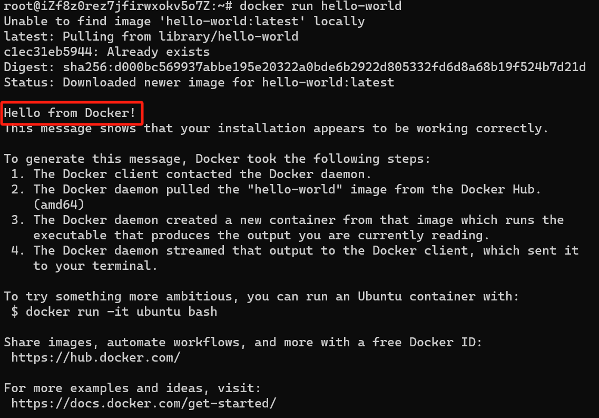

# Docker

> Docker官方文档[Docker overview | Docker Docs](https://docs.docker.com/get-started/overview/)

## 为什么要学习Docker

### 环境(切换/配置)麻烦

如果你问一个计算机学生，学计算机过程中最痛苦的事情，那么他们一定会回答：配环境，而不是写代码。

举两个最经典的例子：

- 每个大一学生一定尝试过为VScode配置C/C++环境。在配置过程中，你不仅需要下载GCC和MinGW，还要为其配置环境变量才能跑起来，对新手而言这个过程至少要花两个小时才能完成。
- A开发后的程序能够在A的环境上运行，而在B的环境上不能运行

### 应用之间需要隔离

假设两个应用部署在同一台服务器上，可能会出现以下问题：

- 如果一个应用出现了问题，导致CPU占100%。那另一个应用也会受到关联。
- 不同应用的依赖安装在同一个服务器上，造成**各种冲突/无法兼容**。例如笔者亲自经历过的PyQt5与Qt冲突。
- 应用之间端口冲突，这是因为一台设备上的不同应用不能使用相同端口。

> 关于端口：
>
> - 当设备作为接收方时，传输层则要负责把数据包传给应用，但是一台设备上可能会有很多应用在接收或者传输数据，因此需要用一个编号将应用区分开来，这个编号就是**端口**。
> - 比如 80 端口通常是 Web 服务器用的，22 端口通常是远程登录服务器用的。而对于浏览器（客户端）中的每个标签栏都是一个独立的进程，操作系统会为这些进程分配临时的端口号。
> - 由于传输层的报文中会携带端口号，因此接收方可以识别出该报文是发送给哪个应用。

**而Docker就是解决以上问题的一门必备技术。**

## 初步认识Docker

> 介绍什么是Docker是一件非常简单的事情，然而，我们学习一门技术最重要的是了解这项技术背后的原理和思想，而不是为了技术而技术。

首先我们要明确一个关系：

1. Docker是容器技术中比较出名的一种，容器技术不只有Docker
2. 容器技术是虚拟化技术中的一种，虚拟化技术不只有容器技术


既然我们要认识的Docker属于虚拟化技术的一种，那么为什么会有虚拟化技术？又是如何发展出容器技术的？

### 什么是虚拟化？

如果你是一个公司老总，试想这么两个问题：

- 你手上有一台高性能的服务器，但你的业务只能使用这台服务器的20%性能，如果继续使用这台服务器跑单一业务，那么额外的80%性能就会白白浪费。
- 你手上还有一堆老旧的服务器，单个服务器还能跑，但性能并不能支撑公司的业务，如果丢弃这些老旧的服务器又觉得可惜。

那么你会怎么解决这两个问题呢？

答案非常明显：

- 对于问题一，我们通常会选择把多余的性能用在其他的业务上——如果自己公司业务只用了20%，那么我们可以将80%的性能租给其他的公司让他们跑自己的业务
- 对于问题二，我们通常会将这些零碎的服务器资源拼凑起来，最终变成一台性能足够使用的服务器

但新的问题也随之而来：直接使用物理机并不能实现以上做法，这涉及到我们一开始所讲的应用隔离问题——其他人的应用如果与我们的应用共享资源，只要他们的应用崩溃或者占用较多资源，都会导致我们的应用崩溃。对于做法二，我们也比较难将硬件资源直接组合在一起从而实现资源的整合。

因此，我们需要虚拟化。

上述提到的两种问题，我们归纳为**高性能硬件性能过剩和老旧低性能硬件的重组重用**

而对于新产生的问题，我们归纳为**资源隔离问题**

**虚拟化正是一门为了解决这些问题而产生的技术。**

> 维基百科: 
>
> **虚拟化（技术）**或**虚拟技术**（英语：Virtualization）是一种资源管理技术，是将计算机的各种[实体资源](https://zh.wikipedia.org/wiki/資源_(計算機科學))（[CPU](https://zh.wikipedia.org/wiki/CPU)、[内存](https://zh.wikipedia.org/wiki/内存)、[磁盘空间](https://zh.wikipedia.org/wiki/磁盘空间)、[网络适配器](https://zh.wikipedia.org/wiki/網路適配器)等），予以抽象、转换后呈现出来并可供分割、组合为一个或多个电脑配置环境。由此，打破实体结构间的不可切割的障碍，使用户可以比原本的配置更好的方式来应用这些电脑硬件资源。这些资源的新虚拟部分是不受现有资源的架设方式，地域或物理配置所限制。一般所指的虚拟化资源包括计算能力和资料存储。

简单来说，虚拟化就是将实体资源（[CPU](https://zh.wikipedia.org/wiki/CPU)、[内存](https://zh.wikipedia.org/wiki/内存)、[磁盘空间](https://zh.wikipedia.org/wiki/磁盘空间)、[网络适配器](https://zh.wikipedia.org/wiki/網路適配器)等）抽象化，将这些实体的资源通过抽象放入一个资源池，提供给客户使用。

按照抽象程度我们可以简单分为四类虚拟化

#### 硬件抽象层等级的虚拟化

我们常说的**”虚拟机“**。

这一次层级的虚拟化划分的实体资源为硬件资源，将不同硬件资源组交给不同的虚拟机使用，从而实现一台宿主机能够运行多台虚拟机。

通过软件（例如VMWare）将宿主机的硬件资源（例如硬件和内存）进行划分，划分后的不同资源组用来模拟一台物理机的硬件，包括不同架构的处理器、内存、总线、磁盘IO等硬件设备。模拟得到的虚拟机可以安装不同的系统，运行虚拟机时，软件会将虚拟机所发出的指令，转换为宿主机能够执行的指令，在宿主机上执行。

#### 操作系统等级的虚拟化

我们常说的**”容器“**。

这一次层级的虚拟化划分的实体资源为操作系统资源，将操作系统所管理的计算机资源，包括进程、文件、设备、网络等分组，然后交给不同的容器使用，从而实现一个操作系统能够运行多个容器。

实现操作系统虚拟化需要用到Namespace及cgroups技术。

- 命名空间（Namespace）：
  - **从命名和编号的角度进行隔离**
  - 简单来说，就是为了重用变量名或者服务例程名。例如，在没有操作系统级虚拟化的Linux系统中，用户态进程从1开始编号(PID)。引入操作系统虚拟化之后，不同容器有着不同的PID命名空间，每个容器中的进程都可以从1开始编号而不产生冲突。
  - 命名空间通过系统调用（system calls）来实现
- 控制组(Cgroups)：
  - **将进程进行分组，并真正的将各组进程的计算资源进行限制、隔离**
  - 控制组是一种内核机制，它可以对进程进行分组、跟踪限制其使用的计算资源。对于每一类计算资源，控制组通过所谓的子系统(subsystem)来进行控制
  - 与命名空间不同，控制组并没有增加系统调用，而是实现了一个文件系统，通过文件及目录操作来管理控制组。

#### 函式库等级的虚拟化

典型应用就是Wine（**Win**dows **E**nvironment），他能够在linux上运行windows程序。

> Wine不是模拟Windows的工具，而是运用[API](https://baike.baidu.com/item/API/10154?fromModule=lemma_inlink)转换技术实做出Linux对应到Windows相对应的函数来调用DLL（[动态链接库](https://baike.baidu.com/item/动态链接库/100352?fromModule=lemma_inlink)）以运行[Windows程序](https://baike.baidu.com/item/Windows程序/15644576?fromModule=lemma_inlink)。

应用软件最终都是使用系统库函数完成功能的，不同的操作系统有不同的函数接口，函数库的虚拟化就是虚拟操作系统的函数接口， 从而实现让软件不需要修改就能运行在原本没有库函数的操作系统上。

#### 进程层面的虚拟化

典型代表：Java的JVM，Andriod上的Dailvik和ART等。

本质是系统的一个进程，该进程模拟一台抽象的计算机（包括处理器、堆栈、寄存器等，但与前面所提到的虚拟机的模拟硬件体系结构完全不同），用于在平台无关的环境中执行程序指令

#### 虚拟机

> 总感觉提到虚拟化不详细聊聊虚拟机好像少了点什么

再回顾一遍：虚拟机是指通过软件模拟的具有完整硬件系统功能的、运行在一个完全隔离环境中的完整计算机系统。

我们提到过，硬件抽象层等级的虚拟化是通过使用一个软件模拟硬件资源。这个软件真实名字为”虚拟机管理程序“（也叫虚拟机监视器（Virtual Machine Monitor，VMM），又称 **Hypervisor**）

 **Hypervisor**运行在宿主物理机和虚拟机之间，允许多个虚拟机和应用共享一套基础物理硬件。 **Hypervisor**对物理硬件进行划分，给每一台虚拟机分配适量的内存，cpu，网络和磁盘资源，并且加载所有虚拟机的客户操作系统。

简而言之，**Hypervisor**为虚拟机操作系统模拟一个物理机的环境。

在Intel处理器中划分了四个特权级别ring 0 ~ ring 3，其中ring 0是最高级别，ring 3是最低级别，一般操作系统内核运行在ring 0上， 这样就能运行处理器的所有指令，但是应用程序则运行在ring 3上，有部分指令（特权指令）是运行不了的。


**I 型虚拟化和 II 型虚拟化**

1974年的一篇文章 Formal requirements for virtualizable third generation architectures 将Hypervisor按实现结构分成了两种类型， 这个划分方法影响至今。

第一种Hypervisor是直接跑在宿主机上面作为操作系统的，特点是需要硬件支持、程序作为操作系统运行、效率高。客户机操作系统跑在上面对底层资源的访问都会 被Hypervisor拦截，由它代为操作并返回结果，从而实现对系统资源的隔离。采用这种类型的虚拟机软件有VMware ESXi、 Xen等。


第二种Hypervisor是作为应用程序跑在操作系统上的，客户端机操作系统跑在他上面所有访问也会被拦截，由于Hypervisor不直接访问硬件资源， 因此运行效率通常比第一种低。采用这种类型的虚拟机软件有VMware Workstation、VirtualBox等。


### 什么是容器？

容器是一种沙盒/沙箱(sandboxing)技术。

> **沙箱技术（Sandboxing）**是一种用于隔离正在运行程序的安全机制，其目的是限制不可信进程或不可信代码运行时的访问权限。
>
> 沙箱会为待执行的程序提供了一个虚拟环境。这个虚拟环境中包含一些虚拟的硬件和软件资源，如文件系统、网络、操作系统等，使应用程序或进程可以在该环境中运行。
>
> 在沙箱中运行的程序只能访问沙箱给它加载的资源，而不会影响到外部的应用、系统或平台，避免其对计算机中的其他程序或数据造成永久的更改。

我们已经提到了虚拟化主流技术之一：虚拟机，它能模拟一套完整的硬件，通过在虚拟机上安装一套完整的操作系统，运行各种应用程序

但在实际生产开发环境中，程序员们发现，他们只关注自己需要部署的应用，但每次部署发布都需要在目的服务器构建一个虚拟机，意味着每次都要下载一个完整的操作系统和附带的依赖环境，为部署带来了极大的不便。有没有一种方法，不需要安装操作系统，只需要提供程序运行的最基本环境，就能运行程序呢？

Linux Container（简称LXC）容器技术的诞生（2008年）解决了这个问题。

容器是一种轻量级的虚拟化技术，它允许将**应用程序及其依赖项**打包在一起，形成一个独立、可移植的运行环境。容器在操作系统层面上实现了资源的隔离和限制，使得多个容器可以在同一台主机上共享操作系统内核，同时又能独立运行，互不干扰。

> AWS：创建容器是为了在多个环境中以可预测和可重复的方式打包和运行应用程序。您不必重建环境，只需将应用程序打包，以便在所有类型的物理或虚拟环境中运行。这类似于让宇航员穿上宇航服，而不是在另一个星球上为他们重建地球大气层。

如果读到这里你还觉得有点模糊，不妨再从Container这个单词理解。

Container是集装箱的意思，我们将一个服务涉及的程序和依赖打包进容器就好比将货物装入集装箱。打包后，集装箱可以随意运输，并且运输过程不会受到任何损坏（文件不会损坏）。运输后，无论在货轮上，还是在码头上，打开集装箱都能够获得对应的货物（无论是Windows还是Linux还是其他操作系统，容器都能够正常启动服务）

#### 容器VS虚拟机

我们已经提到，容器比虚拟机更为轻便，表现在：

容器技术属于操作系统等级的虚拟化，而虚拟机属于硬件抽象层等级的虚拟化。

换句话说，容器技术共享宿主机的操作系统内核，每个容器只需包含程序以及程序允许需要的依赖；虚拟机技术共享宿主机的硬件设备，但每个虚拟机需要包含完整的操作系统。


我们在此详细谈谈容器和虚拟机的异同点：

- 相同点：
  - 容器和虚拟机允许应用程序完全隔离，以便我们可以在多个环境中运行。在我看来，这个相同点实际上也是虚拟化技术的共同特点。
- 主要不同点：
  - 工作原理不同：
    - **虚拟机**技术涉及在物理服务器或计算机上安装虚拟化软件。物理计算机称为*主机*，虚拟机称为*客户机*。我们可以根据需要配置和更新客户机操作系统及其应用程序，而不会影响主机操作系统。
    - **容器**技术涉及构建自给自足的软件包，无论这些软件包在哪些机器上运行，性能都始终如一。软件开发人员创建和部署*容器映像*，即包含运行应用程序所需信息的文件。容器映像为只读，计算机系统无法更改。
  - 核心技术不同：
    - **虚拟机**使用**虚拟机监控器**在客户机操作系统和主机操作系统之间进行通信。虚拟机监控器协调资源共享，因此虚拟机与同一硬件上的其他几个虚拟机分开运行。
    - **容器**使用**容器引擎或容器运行时**作为容器和操作系统之间的中间代理，提供和管理应用程序所需的系统资源。
  - 大小不同：
    - 虚拟机映像文件较大（数 GB），因为这些文件包含自己的操作系统。资源增加意味着您可以复制、拆分、抽象和模拟整个服务器、数据库、桌面和网络。
    - 容器文件更轻量，可以用 MB 单位进行衡量。容器只打包运行单个应用程序所需的资源。
  - 启动速度不同
    - 容器启动更快

差别摘要：

| 特性     | 容器                                                         | 虚拟机                                                       |
| -------- | ------------------------------------------------------------ | ------------------------------------------------------------ |
| 定义     | 软件代码包包含应用程序代码、代码库和组成应用程序运行环境的其他依赖项。 | 物理计算机的数字副本。将物理硬件划分为多个环境。             |
| 虚拟化   | 虚拟化操作系统。                                             | 虚拟化底层物理基础设施。                                     |
| 封装     | 运行应用程序或应用程序组件所需的操作系统之上的软件层。       | 操作系统，系统之上的所有软件层，多个应用程序。               |
| 技术     | 容器引擎与底层操作系统进行资源协调。                         | 虚拟机监控器与底层操作系统或硬件进行协调。                   |
| 大小     | 轻量级（以 MB 为单位）。                                     | 重量级（以 GB 为单位）。                                     |
| 控制     | 不易于控制容器外部的环境。                                   | 更易于控制整个环境。                                         |
| 灵活性   | 更灵活。您可以在本地环境和以云为中心的环境之间快速迁移。     | 不够灵活。迁移困难。                                         |
| 可扩展性 | 高度可扩展。微服务可以实现精细的可扩展性。                   | 扩展成本高昂。需要从本地实例切换到云实例以实现经济高效的扩展。 |

#### 如何选择容器or虚拟机？

- **应用程序要求：**如果应用程序需要更强的隔离性，或者需要运行不同操作系统的应用程序，虚拟机可能更合适。
- **资源限制：**如果您有严格的资源限制，容器可以更有效地利用资源。
- **部署环境：**考虑您的部署环境，容器在云计算和微服务架构中更常见，而虚拟机适用于传统部署环境。
- **管理复杂性：**容器通常更容易管理，因为它们可以轻松扩展和更新，而虚拟机管理可能需要更多的手动干预。

当然容器和虚拟机并不是互斥的技术，我们也可以融合使用

### 什么是Docker？

首先要说明一点的是，**容器技术不只有Docker一种**。容器技术遵循同一个 OCI（OpenContainer Initiative，开放容器计划）规范。OCI 包括容器运行时、容器分发和容器镜像的规范，涵盖了使用容器所需的所有功能。所以不同容器技术能够实现相同的功能。

**我们使用Docker一个最主要的原因：Docker功能齐全且简单易学，是当前容器技术的代表，也是市面上最主流的容器技术。这意味着，其他应用对Docker具有良好的支持，如果使用其他容器技术，可能会面临技术文档不全/其他应用不兼容等风险**

Docker，对应中文名为”码头工人“，它形象地描述了Docker的本质——Docker是一个用Go语言实现的开源的应用**容器引擎**。

Docker将应用程序与基础架构（操作系统等）相分离，将应用程序打包并运行在一个称为“容器”的独立的环境中，从而实现一台宿主机上可以运行多个容器。

容器包括了程序本身以及程序运行需要的依赖，与虚拟机不同，容器是轻量级的。

使用Docker我们可以实现**DevOps（开发即运维）**，实现开发代码和部署上线一体化

> DevOps（开发即运维）：Dev指的是Development（开发），Ops指的是Operations（运维）。DevOps就是打通开发运维的壁垒，实现开发运维一体化。

## 进入Docker的世界

从现在开始，我们就要正式开始了解Docker了

### Docker概念介绍

Docker的三大基本概念为：

- 镜像（Image）
- 容器（Container）
- 仓库（Repository）

我们先从Image（镜像）谈起。

#### Docker Image

我们经常会在各种计算机场景听到Image这个词，有System Image，Disk Image还有Process Image等等。其实Image意思非常简单，就是对目标对象的一个映射（a copy of sth)，映射结果就是Image，中文常称为”映像“。

在计算机中，我们使用一个文件来存储对目标对象的拷贝，这种文件称为”映像文件“，它将可执行文件从虚拟内存映射为物理内存。常见的ISO映像文件，就是包含了整个CD内容的拷贝的文件（属于Disk Image）。

而Docker的Image与这种通用的Image概念略有不同

> From Docker Document：
>
> An image is a read-only template with instructions for creating a Docker container. 

在官方文档中，我们读到：Docker Image是创建Docker容器的指令集的只读模板。Docker Image像是一个特殊的文件系统，除了提供容器运行时所需的程序、库、资源、配置等文件外，还包含了一些为运行时准备的配置参数。

当你读到这里的时候，不知道你会不会和我一样，觉得Docker Image只是带有Image，和我们提到的本质为copy的通用的Image概念没有关系。

但我在wikipedia找到了这句话：

> - A Docker **image** is a read-only template used to build containers. Images are used to store and ship applications.[[21\]](https://en.wikipedia.org/wiki/Docker_(software)#cite_note-docker-overview-21) It is a [process image](https://en.wikipedia.org/wiki/Process_image).

Docker Image属于Process Image！

> A [process](https://en.wikipedia.org/wiki/Process_(computing)) image is a copy of a given process's [state](https://en.wikipedia.org/wiki/State_(computer_science)) at a given point in time. It is often used to create [persistence](https://en.wikipedia.org/wiki/Persistence_(computer_science)) within an otherwise volatile system. A common example is a [database management system](https://en.wikipedia.org/wiki/Database_management_system) (DBMS).

也就是说，有这么一个进程，它能够产生新的Docker。而Docker Image就是这个进程的拷贝。而Dockerfile就是指挥这个进程执行什么步骤的大纲。

> Docker Document还提到：
>
> Often, an image is based on another image, with some additional customization. 

这指的是Docker Image采用了UnionFS（联合文件系统），UnionFS是Docker的核心技术之一，我们将在后面的章节（Docker原理）中提到。

#### Container

> From Docker document :
>
> A container is a runnable instance of an image. You can create, start, stop, move, or delete a container using the Docker API or CLI. You can connect a container to one or more networks, attach storage to it, or even create a new image based on its current state.
>
> By default, a container is relatively well isolated from other containers and its host machine. You can control how isolated a container's network, storage, or other underlying subsystems are from other containers or from the host machine.
>
> A container is defined by its image as well as any configuration options you provide to it when you create or start it. When a container is removed, any changes to its state that aren't stored in persistent storage disappear.

简单来说：

- Docker容器是Docker镜像的实例
- Docker容器之间相互隔离，容器也与宿主机隔离，也就是说，单个容器的运行并不会影响到其他容器乃至宿主机
- Docker容器由Docker镜像定义，如果移除Docker容器，那些在Docker容器运行过程产生的未持久化的数据将消失

#### Docker Registries

> A Docker registry stores Docker images. Docker Hub is a public registry that anyone can use, and Docker looks for images on Docker Hub by default. You can even run your own private registry.
>
> When you use the `docker pull` or `docker run` commands, Docker pulls the required images from your configured registry. When you use the `docker push` command, Docker pushes your image to your configured registry.

Docker仓库存储Docker镜像，常见的Docker仓库为Docker Hub（国外），阿里云镜像站（国内），当然你也能拥有自己的Docker 仓库

我们能够像使用Git一样将Docker镜像从仓库下载到本地（docker pull），也可以将自制的Docker镜像从本地上传到仓库（docker push）

### Docker基本架构与原理

Docker采用client-server（客户端与服务器）架构，Docker client和Docker server之间采用基于UNIX sockets或者其他网络接口的REST API进行信息传输


**Docker client**有两种：

1. 普通用户（docker pull, docker push...) 
2. Docker Compose（定义和运行多容器 Docker 应用程序的工具）

**Docker server**有两种：

1. 本地Docker server
2. 远程Docker server

#### Docker Server

从上图中可以看到Docker Host由三个部分构成：Docker daemon（`dockerd`），Images和Containers，也就是说，我们使用的容器和镜像都存储在Docker Host中，而不是在Docker client。

> 计算机中的Engine通常指核心代码模块

<u>安装Docker时，官方默认安装Docker Engine，其中包括了Docker的CLI（也就是Client）和Docker的daemon（也就是Server）</u> 

我们通常的Docker 操作都是通过使用Docker client与本地的Docker daemon交互执行，如果想使用Client端远程连接Server，不能安装官网提供的标准安装包。

Docker Host即Docker server。Docker Host可以和Docker client在同一个操作系统（即本机同时运行client端和server端），也可以通过client端远程连接另一台设备的Docker server。

> daemon（守护进程）：就是一直在后台运行的进程

其中的Docker daemon作为Docker server的守护进程。Docker daemon是Docker server的核心工作进程，负责接收Docker client的请求并且对Images和Containers进行管理（Images和Containers统称为Docker objects）。因此官方常常使用粒度更细的Docker daemon代称Docker server。

#### 分层文件系统

> **文件系统**是计算机系统中用于组织和存储文件的一种方法。它提供了一种结构化的方式来管理存储设备上的数据，并使用户能够以逻辑方式访问和操作文件。

分层文件系统（Layered File System）是 Docker 容器的核心组成部分之一。Docker 分层文件系统的原理基于联合文件系统（UnionFS）。

Union文件系统（UnionFS)是一种分层、轻量级并且高性能的文件系统，它支持对文件系统的修改作为一次提交来一层层的叠加，同时可以将不同目录挂载到同一个虚拟文件系统下。

Docker镜像使用分层文件系统（Layered File System）来构建，构建方法简单来说就是在基础镜像基础上，每添加一个修改，就会在新一层添加新的文件系统，最终构建为多不同层文件系统叠加在一起的完整镜像。具体构建方法见Dockerfile。

**分层文件系统的好处：**

1. 节省存储空间：由于分层文件系统的特性，当多个容器共享相同文件层时，只需在磁盘中保存一份，从而大大减少了存储空间的占用。
2. 快速部署和更新：当容器需要更新时，Docker 只需下载和应用新的文件层，而不必重新构建整个容器。这极大地提高了部署和更新的效率。
3. 提高镜像的可复用性：分层文件系统使得容器的每个层都可以被其他容器或镜像所共享，从而让容器镜像的重用更加容易。
4. 更好的隔离性：每个容器的修改只会影响到该容器自身的文件层，不会影响其他容器甚至宿主机的文件系统，提供了良好的隔离性。

### Docker初阶使用


#### 安装Docker

> 官方给出了Docker DeskTop和Docker Engine两种版本
>
> - docker desktop包含虚拟机、图形界面及其他特性比如带了一个单节点的kubernetes集群，虚拟机里有一个Docker CE (Docker Community Edition)守护进程。
>
> - docker engine，根据官方文档包含三部分，
>   - 守护进程dockerd
>   - api，程序可通过api与dockerd交互
>   - 命令行工具客户端docker，命令docker command中的docker
>
> 我们通常安装Docker Engine
>
> 这是笔者的配置
>
> 
>
> 安装教程参考
>
> [Install Docker Engine on Ubuntu | Docker Docs](https://docs.docker.com/engine/install/ubuntu/)

1. 卸载旧Docker配置包

```
for pkg in docker.io docker-doc docker-compose docker-compose-v2 podman-docker containerd runc; do sudo apt-get remove $pkg; done
```


2. 选择安装方法：使用仓库安装

   

   输入以下命令

   ```
   # Add Docker's official GPG key:
   sudo apt-get update
   sudo apt-get install ca-certificates curl
   sudo install -m 0755 -d /etc/apt/keyrings
   sudo curl -fsSL https://download.docker.com/linux/ubuntu/gpg -o /etc/apt/keyrings/docker.asc
   sudo chmod a+r /etc/apt/keyrings/docker.asc
   
   # Add the repository to Apt sources:
   echo \
     "deb [arch=$(dpkg --print-architecture) signed-by=/etc/apt/keyrings/docker.asc] https://download.docker.com/linux/ubuntu \
     $(. /etc/os-release && echo "$VERSION_CODENAME") stable" | \
     sudo tee /etc/apt/sources.list.d/docker.list > /dev/null
   sudo apt-get update
   ```

   

3. 下载Docker包

   ```
   sudo apt-get install docker-ce docker-ce-cli containerd.io docker-buildx-plugin docker-compose-plugin
   ```

   输入docker version出现以下结果

   

4. 测试hello-world镜像

   ```
   sudo docker run hello-world
   ```

   出现以下结果则成功

   

#### 配置镜像源

当前镜像源地址默认为国外的docker hub地址

改为国内镜像源地址能够大幅加速镜像下载

[docker 设置国内镜像源 - 炎黄子孙，龙的传人 - 博客园 (cnblogs.com)](https://www.cnblogs.com/eddyz/p/17168828.html)

#### 镜像指令

##### 查看镜像

```shell
[root@localhost ~]# docker images
REPOSITORY          TAG                 IMAGE ID            CREATED             SIZE
hello-world         latest              bf756fb1ae65        7 months ago        13.3kB
```

- `REPOSITORY`：镜像在仓库中的名称，本文中以后都简称镜像名称
- `TAG`：镜像标签
- `IMAGE ID`：镜像 ID
- `CREATED`：镜像的创建日期（不是获取该镜像的日期）
- `SIZE`：镜像大小

这些镜像都是存储在 Docker 宿主机的 `/var/lib/docker` 目录下。

```
docker images
```

- `-a` 展示所有镜像
- `-q` 仅展示镜像的ID
- `-aq` 展示所有镜像的ID

##### 搜索镜像

```shell
docker search 镜像名称
```


##### 拉取镜像

```shell
docker pull 镜像名称
docker pull centos #拉取最新版本
docker pull centos:7 #拉取指定版本
```

不声明tag镜像标签信息默认拉取latest版本

也可以通过：[https://hub.docker.com/](https://link.zhihu.com/?target=https%3A//hub.docker.com/) 搜索该镜像，查看支持的 tag 信息。


另外，在拉取结果中我们可以观察到分层文件系统的存在：

如下图，红框内容即为分层文件系统


##### 删除镜像

```shell
# 删除单个镜像
docker rmi 镜像ID
# 删除多个镜像
docker rmi 镜像ID 镜像ID 镜像ID
# 删除所有镜像
docker rmi $(docker images -aq)
```

注意：如果通过某个镜像创建了容器，则该镜像无法删除。
解决办法：先删除镜像中的容器，再删除该镜像。

#### 容器指令

##### 查看容器

```
[root@localhost ~]# docker ps
CONTAINER ID        IMAGE        COMMAND        CREATED        STATUS        PORTS        NAMES
```

- `CONTAINER ID`：容器 ID
- `IMAGE`：所属镜像
- `COMMAND`：
- `CREATED`：创建时间
- `STATUS`：容器状态
- `PORTS`：端口
- `NAMES`：容器名称

查看停止的容器。

```bash
docker ps -f status=exited
```

查看所有容器（包括运行和停止）。

```bash
docker ps -a
```

查看最后一次运行的容器。

```bash
docker ps -l
```

##### 创建与启动容器

```bash
docker run [OPTIONS] IMAGE [COMMAND] [ARG...]
```

- `-i`：表示运行容器；

- `-t`：表示容器启动后会进入其命令行。加入这两个参数后，容器创建就能登录进去。即分配一个伪终端；

- `--name`：为创建的容器命名；

- `-v`：表示目录映射关系（前者是宿主机目录，后者是映射到宿主机上的目录），可以使用多个 -v 做多个目录或文件映射。注意：最好做目录映射，在宿主机上做修改，然后共享到容器上；

- `-d`：在 run 后面加上 -d 参数，则会创建一个守护式容器在后台运行（这样创建容器后不会自动登录容器，如果只加 -i -t 两个参数，创建容器后就会自动进容器里）

  > 前台进程：与用户交互的进程
  >
  > 后台进程：又叫守护进程，不和用户交互

- `-p`：表示端口映射，**前者是宿主机端口，后者是容器内的映射端口。**可以使用多个 -p 做多个端口映射。

- `-P`：随机使用宿主机的可用端口与容器内暴露的端口映射。

##### 创建并进入容器

下面这行命令的意思就是通过镜像 AA 创建一个容器 BB，运行容器并进入容器的 `/bin/bash`。

```bash
docker run -it --name 容器名称 镜像名称:标签 /bin/bash
```

> 注意：Docker 容器运行必须有一个前台进程， 如果没有前台进程执行，容器认为是空闲状态，就会自动退出。

**退出当前容器**

```bash
exit #退出并停止当前容器
Ctrl+P和Ctrl+Q分别按，可以退出容器，让容器仍运行
```

###### 守护式方式创建容器

```bash
docker run -di --name 容器名称 镜像名称:标签
```

###### **登录守护式容器方式**

```bash
docker exec -it 容器名称|容器ID /bin/bash
```

> 语法：
>
> docker exec [OPTIONS] CONTAINER COMMAND [ARG...]
>
> 作用：
>
> Execute a command in a running container
>
> OPTIONS说明：
>
> - **-d :**分离模式: 在后台运行
> - **-i :**即使没有附加也保持STDIN 打开
> - **-t :**分配一个伪终端

##### 停止与启动容器

```bash
# 停止容器
docker stop 容器名称|容器ID
# 启动容器
docker start 容器名称|容器ID
```

#### 其他命令

##### 查看日志

```
docker logs
```

##### 进入正在运行的容器

```shell
# 方法一：开启一个新的容器的终端
docker exec 容器id/容器名

# 方法二：进入容器正在执行的终端
docker attach 容器id/容器名
```

##### 从容器内拷贝文件到主机上

```
# 进入容器后
docker cp 容器id/容器名:容器内文件路径 主机文件路径
```


#### 数据管理

> 参考文献：
>
> https://docs.docker.com/storage/
>
> https://docs.docker.com/storage/volumes/
>
> https://docs.docker.com/storage/bind-mounts/
>
> https://blog.logrocket.com/docker-volumes-vs-bind-mounts/
>
> https://medium.com/@williehung/persisting-data-using-docker-volume-and-bind-mount-52a8cb42f4f0

在使用容器时有一个问题：对于例如MySQL的应用，装载在容器中运行，运行过程中会产生数据，而由于这些数据存储在容器中，如果容器被删除，那么这些数据也会消失——这不是我们所希望看见的，我们希望将容器产生的数据持久化，这样一来，我们可以非常方便删除和产生新的容器，而不需要担心数据丢失的问题。这就需要用到Docker的数据管理技术。

> 卷就是目录或文件，数据卷是一个虚拟目录，指向宿主机文件系统中的某个目录，它们的修改是双向同步的

当前数据管理技术有两种：Docker主要支持的数据卷技术和绑定挂载技术。

- 数据卷技术：Docker主要支持（**官方用词为"preferred"**）的持久化数据技术。
- 绑定挂载技术：Docker早期支持的持久化数据技术。

从本质上讲，这两种技术都是针对数据存放目录的位置，这两种技术的区别在于：

- **数据卷技术**面向的主体为**容器**，容器创建并管理数据卷，数据卷以目录的形式存放在容器中，Docker会自动在宿主机上帮我们创建数据卷对应的真实目录，并将容器中的数据卷目录与宿主机的目录相绑定（如果不存在，则在宿主机上创建指定目录），数据卷与宿主机内核功能相隔离。
  - 值得一提的是：**容器挂载时只需要挂载到数据卷上，而不用关心数据卷指向的真实目录在哪里。**即使将来容器被删除了，数据卷中或者宿主机挂载到容器的目录中的内容是不会随着容器的删除而丢失的。（可以看作数据卷是Docker容器给宿主机某个目录取了一个别名，Docker容器之间可以使用这个别名）
- **绑定挂载技术**面向的主体为**宿主机**，宿主机将自己的文件或目录绑定到容器中（如果容器中不存在该文件或目录，则自动创建指定文件或目录）

再进一步谈谈两种技术的优缺点：

- 数据卷技术
  - 优点：
    - volume更加容易进行备份和迁移
    - volume可以在linux和windows容器中运行
    - **与docker更亲和**
      - 可以通过docker客户端命令或者docker api来管理volume (比如：docker volume命令)
      - volume可以更加安全的在多个容器之间进行共享
      - 新volume的内容可以由容器预先填充
    - volume驱动程序允许在远程主机或云提供商上存储卷，以加密volume的内容或添加其他功能
    - Docker Desktop上的卷比Mac和Windows主机上的绑定挂载具有更高的性能。
  - 缺点：真实挂载目录由Docker生成，目录较深，不方便查找。
- 绑定挂载技术
  - 优点：
    - 性能更好（因为目录在宿主机上）
    - 目录和文件更好找也更好维护，并且能直接把目录或者文件挂载到容器上。
  - 缺点：
    - 相比于数据卷功能有限。
    - 依赖于宿主机的目录结构和操作系统
    - 存在安全隐患：我们可以通过容器中运行的进程来更改主机文件系统，包括创建、修改或删除重要的系统文件或目录。这个功能给予容器较大的权限，很可能影响主机系统上的非 Docker 进程。

根据以上优缺点，我们还能列出这两种技术的使用场景：

- **数据卷**（Docker 容器和服务中保存数据的**首选方式**），数据卷的一些用例包括：

  - **在多个运行的容器之间共享数据。**如果您没有显式创建它，则会在第一次将其挂载到容器中时创建一个卷。当该容器停止或被删除时，该卷仍然存在。多个容器可以同时挂载同一卷，无论是读写还是只读。仅当您明确删除卷时，卷才会被删除。
  - 当不保证 Docker 主机具有给定的目录或文件结构时。卷可帮助您将 Docker 主机的配置与容器运行时解耦。
  - 当您想要将容器的数据存储在远程主机或云提供商上，而不是本地时。
  - 当您需要将数据从一台 Docker 主机备份、恢复或迁移到另一台时，卷是更好的选择。您可以停止使用该卷的容器，然后备份该卷的目录（例如`/var/lib/docker/volumes/<volume-name>`）。
  - 当您的应用程序需要 Docker Desktop 上的高性能 I/O 时。卷存储在 Linux VM 中而不是主机中，这意味着读取和写入具有更低的延迟和更高的吞吐量。
  - 当您的应用程序需要 Docker Desktop 上完全本机文件系统行为时。例如，数据库引擎需要精确控制磁盘刷新以保证事务的持久性。卷存储在 Linux VM 中，可以做出这些保证，而绑定安装则远程到 macOS 或 Windows，其中文件系统的行为略有不同。

- **绑定挂载**：

  - 将配置文件从主机共享到容器。这就是 Docker 默认为容器提供 DNS 解析的方式，即 `/etc/resolv.conf`从主机挂载到每个容器中。

  - 在 Docker 主机上的开发环境和容器之间共享源代码或构建工件。例如，您可以将 Maven`target/` 目录挂载到容器中，每次在 Docker 主机上构建 Maven 项目时，容器都可以访问重建的工件。

    如果您以这种方式使用 Docker 进行开发，您的生产 Dockerfile 会将生产就绪工件直接复制到映像中，而不是依赖于绑定安装。

  - **当保证Docker主机的文件或目录结构与容器所需的绑定挂载一致时。**

<u>另外，一般情况下，Docker容器将产生的数据存储在容器的可写层中。这种默认存储方式会增加容器的大小，而使用数据卷，由于数据卷独立于容器，因此可以在满足存储数据功能的情况下不影响容器的大小。</u>

到这里你已经对这两种技术有个大概了解了，接下来，我们主要介绍数据卷技术的使用

##### 绑定挂载

```shell
# 指定宿主机目录挂载
docker run -it -v 主机目录:容器目录 --name 容器名 镜像名 /bin/bash
```


##### 数据卷(volumes)使用

数据卷的使用有两种：具名挂载，匿名挂载

可与绑定挂载技术图对比，Type不同：数据卷为volume，绑定挂载为bind


###### 具名挂载

```shell
# 具名挂载
docker run -it/-d -v 数据卷名字:容器目录 --name 容器名 镜像名 /bin/bash
```

如下图，卷名为nginx_dic


###### 匿名挂载

```shell
# 匿名挂载
docker run -it/-d -v 容器目录 --name 容器名 镜像名 /bin/bash
```

如下图，匿名挂载后出现了长字符串组成的卷名


### Docker进阶使用

#### Dockerfile

[万字长文带你看全网最详细Dockerfile教程-腾讯云开发者社区-腾讯云 (tencent.com)](https://cloud.tencent.com/developer/article/2327632)
